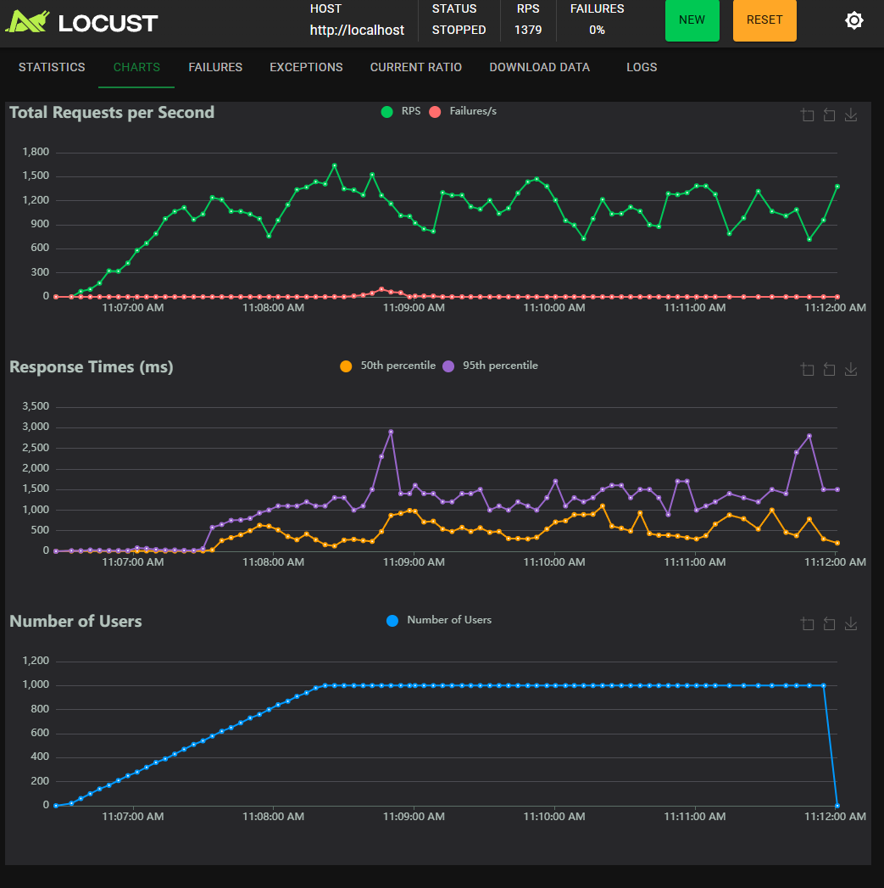

## Strimzi, Faust and Rocketdb

```shell
helm repo add strimzi https://strimzi.io/charts/
helm repo add bitnami https://charts.bitnami.com/bitnami
helm repo add ingress-nginx https://kubernetes.github.io/ingress-nginx
helm repo add kedacore https://kedacore.github.io/charts
helm repo update
helm install strimzi strimzi/strimzi-kafka-operator --create-namespace --namespace kafka
kubectl apply -f k8s/kafka.yaml -n kafka
helm install nginx-ingress ingress-nginx/ingress-nginx --namespace fastapi-test --create-namespace
helm install keda kedacore/keda --namespace keda --create-namespace
kubectl apply k8s/deployment
```

testing:

```shell title="Producer"
kubectl -n kafka run kafka-producer -ti --image=quay.io/strimzi/kafka:0.42.0-kafka-3.7.1 --rm=true --restart=Never -- bin/kafka-console-producer.sh --bootstrap-server my-cluster-kafka-bootstrap:9092 --topic my-topic
```

```shell title="Consumer"
kubectl -n kafka run kafka-consumer -ti --image=quay.io/strimzi/kafka:0.42.0-kafka-3.7.1 --rm=true --restart=Never -- bin/kafka-console-consumer.sh --bootstrap-server my-cluster-kafka-bootstrap:9092 --topic my-topic --from-beginning
```

To launch the command `$shell kubectl apply k8s/deployment`, that contain the fastapi, faust and redis, you need to wait that the `strimzi operator` and kafka is up. If you launch the other files, you will have an error 'cause they can connect to
service.

In this POC, we use strimzi (Kafka operator) and Faust (consumer), to process the data that is produce for and endpoint (like the integration services), this process, register and save the progress of the process (PROGRESS, PENDING, COMPLETE O FAILURE).
This create an UUID, that is used to track the progress of the task. The unique difference with RabbitMQ and Celery, is that, Celery create a task and assign a UUID and save in a DB like PostgreSQL o Redis, here we need to do this the manual way.

## Testing

Using locust, we made a test of load, with 1000 of concurrent users, in this test, we don't have any fail (this is because we really didn't anything, only a wait of 10/15 seconds).

This test is only to know how is the behaviour of Faust and Strimzi.


